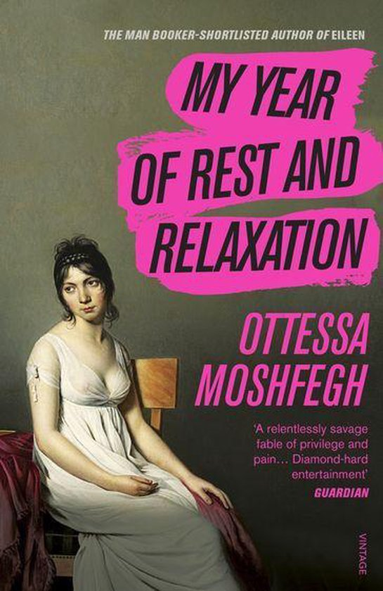

<!doctype html>
<html>
<head>
	<title>Books</title>
	
</head>
<body>
	

		<h1>Recent Books I've Read</h1>
		
 With the end of covid I decided to spend some more time reading, I still havent had the opportunity to do so as often as I would like but heres a little list nonetheless. 

		
 For some reason I found that although I enjoy reading I instead spend that rare time reading internet novels or unpublished works but avoid properly published books due to their size and the time commitment;
		 
As such I decided to expand my horizons, looking through avid readers recommendations for where I should start and what to read. This video is one I found myself referencing:

<!-- The only reason im not using the video element here and instead refering to embed code that youtube gives you directly in the "share" feature is because this video is 30 minutes long and i tried to download it for half an hour and its just didn't go through, i gave up. I want people to have access to the original link and easily get to it so it might be for the best -->	
		<iframe width="560" height="315" src="https://www.youtube.com/embed/zSiOwJ8NlC4?si=vc7q2WgMwrn5bUzB" title="YouTube video player" frameborder="0" allow="accelerometer; autoplay; clipboard-write; encrypted-media; gyroscope; picture-in-picture; web-share" allowfullscreen></iframe>
		<h2>Books I would like to read</h2>
		<ul>
			<li>Oscar Wilde - The Picture of Dorian Gray</li>
			<li>James Baldwin - Giovanni's Room</li>
			<li>Stephen King - Misery</li>
			<li>Shirley Jackson - We Have Always Lived in the Castle</li>
			<li>Taylor Jenkins Reid - The Seven Husbands of Evelyn Hugo</li>
			<li>Eric LaRocca - Things Have Gotten Worse Since We Last Spoke</li>
			<li>Lee Mandelo - Summer Sons</li>
			<li>K Ancrum - The Wicker King</li>
			<li>Jennifer Giesbrecht - The Monster of Elendhaven</li>
			<li>Liann Tsoukas - Mal Goode Reporting</li>
			<li>Upton Sinclair - The Jungle</li>
			<li>Jacob Riis - How the Other Half Lives</li>
			<li>George W. Plunkitt - Plunkitt of Tammany Hall</li>
			<li>Committee of Fifteen - The Social Evil</li>
			<li>Viktor Frankl - Man's Search For Meaning</li>
			<li>Jerzy Kosiński -  The Painted Bird</li>
			<li>Erich Maria Remarque - All Quiet on the Western Front</li>
			<li>Marquis de Sade - Justine</li>
		</ul>
	

	

		<h2>Book Details</h2>
		<table>
			<tr>
				<th>Cover</th>
				<th>Book</th>
				<th>Author</th>
				<th>Progress</th>
			</tr>
			<tr>
				<td></td>
				<td><a href="https://www.goodreads.com/book/show/49203397-these-violent-delights" target="_blank" title="These Violent Delights on Goodreads">These Violent Delights</a></td>
				<td>Micah Nemerever</td>
				<td>Read, finished, and reread</td>
			</tr>
			<tr>
				<td></td>
				<td><a href="https://www.goodreads.com/book/show/17333223-the-goldfinch" target="_blank" title="The Goldfinch on Goodreads">The Goldfinch</a></td>
				<td>Donna Tartt</td>
				<td>Read and finished</td>
			</tr>
			<tr>
				<td></td>
				<td><a href="https://www.goodreads.com/en/book/show/30319086-if-we-were-villains" target="_blank" title="If We Were Villains on Goodreads">If We Were Villains</a></td>
				<td>M. L. Rio</td>
				<td>Read through most of</td>
			</tr>
			<tr>
				<td></td>
				<td><a href="https://www.goodreads.com/book/show/44279110-my-year-of-rest-and-relaxation" target="_blank" title="My Year of Rest and Relaxation">My Year of Rest and Relaxation</a></td>
				<td>Ottessa Moshfegh</td>
				<td>Read through half of</td>
			</tr>
		</table>
	

</body>
</html>
